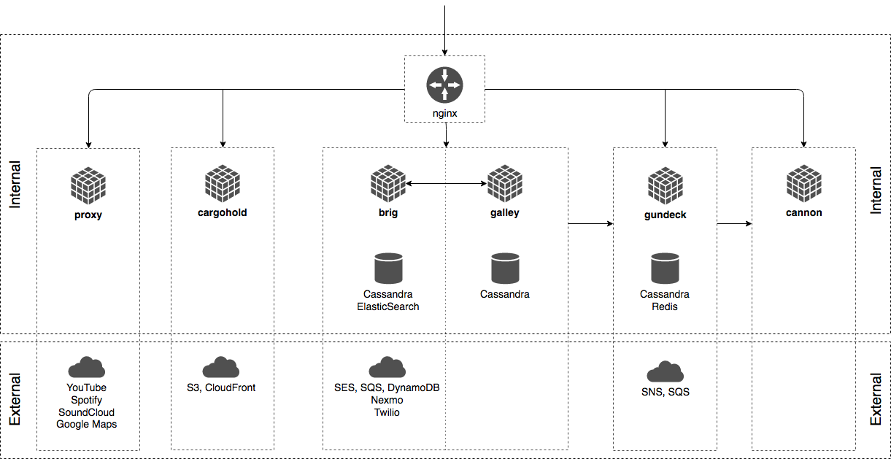

# Wire™

[](https://wire.com/jobs/)

This repository is part of the source code of Wire. You can find more information at [wire.com](https://wire.com) or by contacting opensource@wire.com.

You can find the published source code at [github.com/wireapp/wire](https://github.com/wireapp/wire).

For licensing information, see the attached LICENSE file and the list of third-party licenses at [wire.com/legal/licenses/](https://wire.com/legal/licenses/).

No license is granted to the Wire trademark and its associated logos, all of which will continue to be owned exclusively by Wire Swiss GmbH. Any use of the Wire trademark and/or its associated logos is expressly prohibited without the express prior written consent of Wire Swiss GmbH.

## Wire server

This repository contains the source code for the Wire server. It contains all libraries and services necessary to run Wire.

Documentation on how to self host your own Wire-Server is not yet available but is planned. Federation is on our long term roadmap.

See more in "[Open sourcing Wire server code](https://medium.com/@wireapp/open-sourcing-wire-server-code-ef7866a731d5)".

## Content of the repository

This repository contains the following source code:

- **services**
   - **nginz**: Public API Reverse Proxy (Nginx with custom libzauth module)
   - **galley**: Conversations and Teams
   - **brig**: Accounts
   - **gundeck**: Push Notification Hub
   - **cannon**: WebSocket Push Notifications
   - **cargohold**: Asset (image, file, ...) Storage
   - **proxy**: 3rd Party API Integration
- **tools**
   - **api-simulations**: Run automated smoke and load tests
   - **makedeb**: Create Debian packages
   - **bonanza**: Transform and forward log data
- **libs**: Shared libraries

It also contains

- **build**: Build scripts and Dockerfiles for some platforms
- **deploy**: (Work-in-progress) - how to run wire-server in an ephemeral, in-memory demo mode
- **doc**: Documentation

## Architecture Overview

The following diagram gives a high-level outline of the (deployment) architecture
of the components that make up a Wire Server as well as the main internal and
external dependencies between components.



Communication between internal components is currently not guarded by
dedicated authentication or encryption and is assumed to be confined to a
private network.

## Development setup

### How to build `wire-server` binaries

There are two options:

#### 1. Compile sources natively. 

This requires a range of dependencies that depend on your platform/OS, such as:

- Haskell & Rust compiler and package managers 
- Some package dependencies (libsodium, openssl, protobuf, icu, geoip, snappy, [cryptobox-c](https://github.com/wireapp/cryptobox-c), ...) that depend on your platform/OS

See [doc/Dependencies.md](doc/Dependencies.md) for details. 

Once all dependencies are set up, the following should succeed:

```bash
# build all haskell services
make
# build one haskell service, e.g. brig:
cd services/brig && make
```

For building nginz, see [services/nginz/README.md](services/nginz/README.md)

#### 2. Use docker

*If you don't wish to build all docker images from scratch (e.g. the `alpine-builder` takes a very long time), ready-built images can be downloaded from [here](https://hub.docker.com/r/wireserver/).*

If you wish to build your own docker images, you need [docker version >= 17.05](https://www.docker.com/) and [`make`](https://www.gnu.org/software/make/). Then,

```bash
make docker-services
```

will, eventually, have built a range of docker images. See the `Makefile`s and `Dockerfile`s, as well as [build/alpine/README.md](build/alpine/README.md) for details.

## How to run integration tests

Integration tests require all of the haskell services (brig,galley,cannon,gundeck,proxy,cargohold) to be correctly configured and running, before being able to execute e.g. the `brig-integration` binary. This requires most of the deployment dependencies as seen in the architecture diagram to also be available:

- Required internal dependencies:
    - cassandra (with the correct schema)
    - elasticsearch (with the correct schema)
    - redis
- Required external dependencies are the following configured AWS services (or "fake" replacements providing the same API):
    - SES
    - SQS
    - SNS
    - S3
    - Cloudfront
    - DynamoDB

Setting up these real, but in-memory internal and "fake" external dependencies is done easiest using [`docker-compose`](https://docs.docker.com/compose/install/). Run the following in a separate terminal (it will block that terminal, C-c to shut all these docker images down again):

```
cd deploy/docker-ephemeral && docker-compose up
```

Then, to run all integration tests:

```bash
make integration
```

Or, alternatively, `make` on the top-level directory (to produce all the service's binaries) followed by e.g `cd services/brig && make integration` to run one service's integration tests only.

## How to run `wire-server` with "fake" external dependencies

```
make services
```

Once that finishes, use 2 different terminals to:

```
# Start the dependencies
cd deploy/docker-ephemeral && docker-compose up
```

```
# Start the services
cd services && ./integration.sh
```

### This is fantastic, all services up & running... what now, can I run some kind of smoketests?

Short answer: yes and no. At the moment, you need _one_ AWS service in order to test your cluster with our automated smoketester tool. The `sesEndpoint` in `brig`'s [example configuration](https://github.com/wireapp/wire-server/blob/develop/services/brig/brig.integration.yaml) needs to point to a real AWS SES endpoint.

In your environment, you can configure `AWS_REGION`, `AWS_ACCESS_KEY_ID` and `AWS_SECRET_ACCESS_KEY` for your correct AWS account. Note that there are other ways to specify these credentials (to be detailed later).

Then, have a look at what the configuration for the [api-smoketest](https://github.com/wireapp/wire-server/blob/develop/tools/api-simulations/README.md) should be. Once you have the correct `mailboxes.json`, this should just work from the top level directory (note the `sender-email` must match brig's [sender-email](https://github.com/wireapp/wire-server/blob/develop/services/brig/brig.integration.yaml#L35))

```
./dist/api-smoketest --api-host=127.0.0.1 --api-port=8080 --api-websocket-host=127.0.0.1 --api-websocket-port=8081 --mailbox-config=./tools/api-simulations/mailboxes.json --sender-email=backend-integration@wire.com
```

## How to run `wire-server` with real AWS services

Documentation, configuration, and code for this is **not ready yet** (please do not open an issue to ask about this!). More information on how to run `wire-server` might be available here at some point in the future.

As a brief overview, it requires setting up

* database clusters (cassandra, redis, elasticsearch)
* external dependencies
    * Amazon account with access to
      * SES
      * SQS
      * SNS
      * S3
      * Cloudfront
      * DynamoDB
    * Nexmo/Twilio accounts (if you want to send out SMSes)
    * Giphy/Google/Spotify/Soundcloud API keys (if you want to support previews by proxying these services)
    * TURN servers (if you want to support Voice/Video calls)
* production-ready configuration for all services
* additional infrastructure configuration (DNS, SSL certificates, metrics, logging, etc)

## Roadmap

- Build and deployment options
