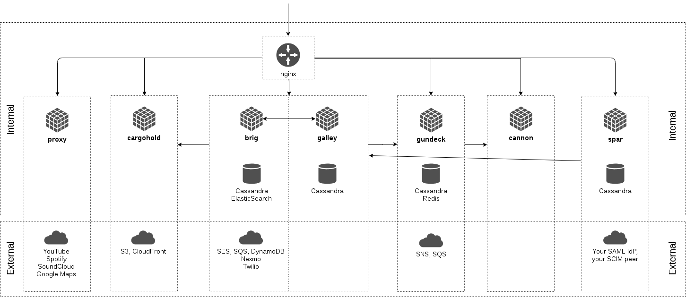

# Wire™

[](https://wire.bamboohr.com/careers)

This repository is part of the source code of Wire. You can find more information at [wire.com](https://wire.com) or by contacting opensource@wire.com.

You can find the published source code at [github.com/wireapp/wire](https://github.com/wireapp/wire).

For licensing information, see the attached LICENSE file and the list of third-party licenses at [wire.com/legal/licenses/](https://wire.com/legal/licenses/).

No license is granted to the Wire trademark and its associated logos, all of which will continue to be owned exclusively by Wire Swiss GmbH. Any use of the Wire trademark and/or its associated logos is expressly prohibited without the express prior written consent of Wire Swiss GmbH.

## Wire server

This repository contains the source code for the Wire server. It contains all libraries and services necessary to run Wire.

For documentation on how to self host your own Wire-Server see [this section](#how-to-install-and-run-wire-server). Federation is on our long term roadmap.

See more in "[Open sourcing Wire server code](https://medium.com/@wireapp/open-sourcing-wire-server-code-ef7866a731d5)".

## Contents of this repository

This repository contains the following source code:

- **services**
   - **nginz**: Public API Reverse Proxy (Nginx with custom libzauth module)
   - **galley**: Conversations and Teams
   - **brig**: Accounts
   - **gundeck**: Push Notification Hub
   - **cannon**: WebSocket Push Notifications
   - **cargohold**: Asset (image, file, ...) Storage
   - **proxy**: 3rd Party API Integration
   - **restund**: STUN/TURN server for use in Audio/Video calls
   - **spar**: Single-Sign-On (SSO)

- **tools**
   - **db/**: Migration tools (e.g. when new tables are added)
   - **stern/**: Backoffice tool (basic [Swagger](https://swagger.io/) based interface)

- **libs**: Shared libraries

It also contains

- **build**: Build scripts and Dockerfiles for some platforms
- **deploy**: (Work-in-progress) - how to run wire-server in an ephemeral, in-memory demo mode
- **doc**: Documentation
- **hack**: scripts and configuration for kuberentes helm chart development/releases mainly used by CI
- **charts**: Kubernetes Helm charts. The charts are mirroed to S3 and can be used with `helm repo add wire https://s3-eu-west-1.amazonaws.com/public.wire.com/charts`. See the [Administrator's Guide](https://docs.wire.com) for more info.

## Architecture Overview

The following diagram gives a high-level outline of the (deployment) architecture
of the components that make up a Wire Server as well as the main internal and
external dependencies between components.



Communication between internal components is currently not guarded by
dedicated authentication or encryption and is assumed to be confined to a
private network.

## Development setup

### How to build `wire-server` binaries

There are two options:

#### 1. Use docker

*If you don't wish to build all docker images from scratch (e.g. the `ubuntu20-builder` takes a very long time), ready-built images can be downloaded from [here](https://quay.io/organization/wire).*

If you wish to build your own docker images, you need [docker version >= 17.05](https://www.docker.com/) and [`make`](https://www.gnu.org/software/make/). Then,

```bash
# optionally:
# make docker-builder # if you don't run this, it pulls the ubuntu20-builder image from quay.io
make docker-deps docker-intermediate docker-services

# subsequent times, after changing code, if you wish to re-create docker images, it's sufficient to
make docker-intermediate docker-services
```

will, eventually, have built a range of docker images. Make sure to [give Docker enough RAM](https://github.com/wireapp/wire-server/issues/562); if you see `make: *** [builder] Error 137`, it might be a sign that the build ran out of memory. You can also mix and match – e.g. pull the [`ubuntu20-builder`](https://quay.io/repository/wire/ubuntu20-builder?tab=tags) image and build the rest locally.

See the `Makefile`s and `Dockerfile`s, as well as [build/ubuntu/README.md](build/ubuntu/README.md) for details.

#### 2. Use nix-provided build environment

This is suitable only for local development and testing. See [build instructions](./docs/src/developer/developer/building.md) in the developer documentation.

## How to install and run `wire-server`

You have two options:

* Option 1. (recommended) Install wire-server on kubernetes using the configuration and instructions provided in [wire-server-deploy](https://github.com/wireapp/wire-server-deploy). This is the best option to run it on a server and recommended if you want to self-host wire-server.

* Option 2. Compile everything in this repo, then you can use the `dist/run-services`. This option is intended as a way to try out wire-server on your local development machine and not suited for production.

TEST2
