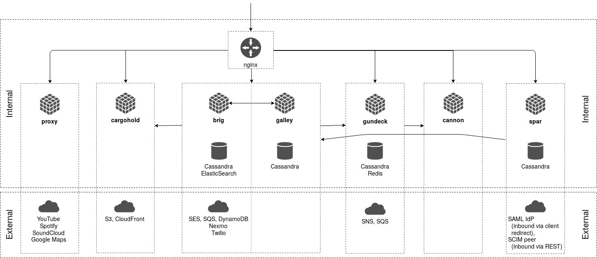

# Wire™

[](https://wire.com/jobs/)

This repository is part of the source code of Wire. You can find more information at [wire.com](https://wire.com) or by contacting opensource@wire.com.

You can find the published source code at [github.com/wireapp/wire](https://github.com/wireapp/wire).

For licensing information, see the attached LICENSE file and the list of third-party licenses at [wire.com/legal/licenses/](https://wire.com/legal/licenses/).

No license is granted to the Wire trademark and its associated logos, all of which will continue to be owned exclusively by Wire Swiss GmbH. Any use of the Wire trademark and/or its associated logos is expressly prohibited without the express prior written consent of Wire Swiss GmbH.

## Wire server

This repository contains the source code for the Wire server. It contains all libraries and services necessary to run Wire.

For documentation on how to self host your own Wire-Server see [this section](#how-to-install-and-run-wire-server). Federation is on our long term roadmap.

See more in "[Open sourcing Wire server code](https://medium.com/@wireapp/open-sourcing-wire-server-code-ef7866a731d5)".

## Table of contents

<!-- vim-markdown-toc GFM -->

* [Contents of this repository](#contents-of-this-repository)
* [Architecture Overview](#architecture-overview)
* [Development setup](#development-setup)
    * [How to build `wire-server` binaries](#how-to-build-wire-server-binaries)
        * [1. Compile sources natively.](#1-compile-sources-natively)
        * [2. Use docker](#2-use-docker)
    * [How to run integration tests](#how-to-run-integration-tests)
    * [when you need more fine-grained control over your build-test loops](#when-you-need-more-fine-grained-control-over-your-build-test-loops)
* [How to install and run `wire-server`](#how-to-install-and-run-wire-server)

<!-- vim-markdown-toc -->

## Contents of this repository

This repository contains the following source code:

- **services**
   - **nginz**: Public API Reverse Proxy (Nginx with custom libzauth module)
   - **galley**: Conversations and Teams
   - **brig**: Accounts
   - **gundeck**: Push Notification Hub
   - **cannon**: WebSocket Push Notifications
   - **cargohold**: Asset (image, file, ...) Storage
   - **proxy**: 3rd Party API Integration
   - **restund**: STUN/TURN server for use in Audio/Video calls
   - **spar**: Single-Sign-On (SSO)

- **tools**
   - **api-simulations**: Run automated smoke and load tests
   - **makedeb**: Create Debian packages
   - **bonanza**: Transform and forward log data
   - **db/**: Migration tools (e.g. when new tables are added)
   - **stern/**: Backoffice tool (basic [Swagger](https://swagger.io/) based interface)

- **libs**: Shared libraries

It also contains

- **build**: Build scripts and Dockerfiles for some platforms
- **deploy**: (Work-in-progress) - how to run wire-server in an ephemeral, in-memory demo mode
- **doc**: Documentation
- **hack**: scripts and configuration for kuberentes helm chart development/releases mainly used by CI
- **charts**: Kubernetes Helm charts. The charts are mirroed to S3 and can be used with `helm repo add wire https://s3-eu-west-1.amazonaws.com/public.wire.com/charts`. See the [Administrator's Guide](https://docs.wire.com) for more info.

## Architecture Overview

The following diagram gives a high-level outline of the (deployment) architecture
of the components that make up a Wire Server as well as the main internal and
external dependencies between components.



Communication between internal components is currently not guarded by
dedicated authentication or encryption and is assumed to be confined to a
private network.

## Development setup

### How to build `wire-server` binaries

There are two options:

#### 1. Compile sources natively.

This requires a range of dependencies that depend on your platform/OS, such as:

- Haskell & Rust compiler and package managers
- Some package dependencies (libsodium, openssl, protobuf, icu, geoip, snappy, [cryptobox-c](https://github.com/wireapp/cryptobox-c), ...) that depend on your platform/OS

See [docs/developer/dependencies.md](docs/developer/dependencies.md) for details.

Once all dependencies are set up, the following should succeed:

```bash
# build all haskell services
make
# build one haskell service, e.g. brig:
cd services/brig && make
```

The default make target (`fast`) compiles unoptimized (faster compilation time, slower binaries), which should be fine for development purposes. Use `make install` to get optimized binaries.

For building nginz, see [services/nginz/README.md](services/nginz/README.md)

#### 2. Use docker

*If you don't wish to build all docker images from scratch (e.g. the `alpine-builder` takes a very long time), ready-built images can be downloaded from [here](https://quay.io/organization/wire).*

If you wish to build your own docker images, you need [docker version >= 17.05](https://www.docker.com/) and [`make`](https://www.gnu.org/software/make/). Then,

```bash
# optionally:
# make docker-builder # if you don't run this, it pulls the alpine-builder image from quay.io
make docker-deps docker-intermediate docker-services

# subsequent times, after changing code, if you wish to re-create docker images, it's sufficient to
make docker-intermediate docker-services
```

will, eventually, have built a range of docker images. Make sure to [give Docker enough RAM](https://github.com/wireapp/wire-server/issues/562); if you see `make: *** [builder] Error 137`, it might be a sign that the build ran out of memory. You can also mix and match – e.g. pull the [`alpine-builder`](https://quay.io/repository/wire/alpine-builder?tab=tags) image and build the rest locally.

See the `Makefile`s and `Dockerfile`s, as well as [build/alpine/README.md](build/alpine/README.md) for details.

### How to run integration tests

Integration tests require all of the haskell services (brig, galley, cannon, gundeck, proxy, cargohold, spar) to be correctly configured and running, before being able to execute e.g. the `brig-integration` binary. The test for brig also starts nginz, so make sure it has been built before.
These services require most of the deployment dependencies as seen in the architecture diagram to also be available:

- Required internal dependencies:
    - cassandra (with the correct schema)
    - elasticsearch (with the correct schema)
    - redis
- Required external dependencies are the following configured AWS services (or "fake" replacements providing the same API):
    - SES
    - SQS
    - SNS
    - S3
    - DynamoDB
- Required additional software:
    - netcat (in order to allow the services being tested to talk to the dependencies above)

Setting up these real, but in-memory internal and "fake" external dependencies is done easiest using [`docker-compose`](https://docs.docker.com/compose/install/). Run the following in a separate terminal (it will block that terminal, C-c to shut all these docker images down again):

```
deploy/dockerephemeral/run.sh
```

Then, to run all integration tests:

```bash
make integration
```

Or, alternatively, `make` on the top-level directory (to produce all the service's binaries) followed by e.g `cd services/brig && make integration` to run one service's integration tests only.

### when you need more fine-grained control over your build-test loops

You can use `$WIRE_STACK_OPTIONS` to pass arguments to stack through the `Makefile`s.  This is useful to e.g. pass arguments to a unit test suite or temporarily disable `-Werror` without the risk of accidentally committing anything, like this:

```bash
WIRE_STACK_OPTIONS='--ghc-options=-Wwarn --test-arguments="--quickcheck-tests=19919 --quickcheck-replay=651712"' make -C services/gundeck
```

Integration tests are run via `/services/integration.sh`, which does not know about stack or `$WIRE_STACK_OPTIONS`.  Here you can use `$WIRE_INTEGRATION_TEST_OPTIONS`:

```bash
cd services/spar
WIRE_INTEGRATION_TEST_OPTIONS="--match='POST /identity-providers'" make i
```

Alternatively, you can use [tasty's support for passing arguments vie shell variables directly](https://github.com/feuerbach/tasty#runtime).  Or, in the case of spar, the [hspec equivalent](https://hspec.github.io/options.html#specifying-options-through-an-environment-variable), which [is less helpful at times](https://github.com/hspec/hspec/issues/335).

## How to install and run `wire-server`

You have two options:

* Option 1. (recommended) Install wire-server on kubernetes using the configuration and instructions provided in [wire-server-deploy](https://github.com/wireapp/wire-server-deploy). This is the best option to run it on a server and recommended if you want to self-host wire-server.
* Option 2. Compile everything in this repo, then you can use the [docker-compose based demo](deploy/services-demo/README.md). This option is intended as a way to try out wire-server on your local development machine and is less suited when you want to install wire-server on a server.
