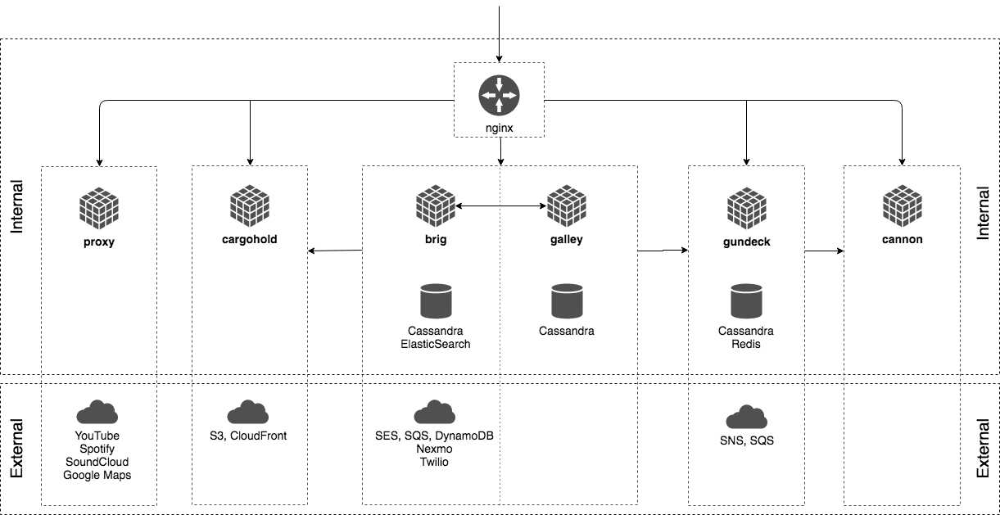

# Wire™

This repository is part of the source code of Wire. You can find more information at [wire.com](https://wire.com) or by contacting opensource@wire.com.

You can find the published source code at [github.com/wireapp/wire](https://github.com/wireapp/wire).

For licensing information, see the attached LICENSE file and the list of third-party licenses at [wire.com/legal/licenses/](https://wire.com/legal/licenses/).

No license is granted to the Wire trademark and its associated logos, all of which will continue to be owned exclusively by Wire Swiss GmbH. Any use of the Wire trademark and/or its associated logos is expressly prohibited without the express prior written consent of Wire Swiss GmbH.

## Wire server

This repository contains the source code for the Wire server. It contains all libraries and services necessary to run Wire.

Self hosting and federation is on our long term roadmap.

See more in "[Open sourcing Wire server code](https://medium.com/@wireapp/open-sourcing-wire-server-code-ef7866a731d5)".

## Content of the repository
This repository contains:

- **services**
   - **nginz**: Public API Reverse Proxy
   - **galley**: Conversations
   - **brig**: Accounts
   - **gundeck**: Push Notification Hub
   - **cannon**: WebSocket Push Notifications
   - **cargohold**: Asset Storage
   - **proxy**: 3rd Party API Integration
- **libs**: Shared libraries

## Architecture Overview

The following diagram gives a high-level outline of the (deployment) architecture
of the components that make up a Wire Server as well as the main internal and
external dependencies between components.

Communication between internal components is currently not guarded by
dedicated authentication or encryption and is assumed to be confined to a
private network.

## How do I build `wire-server` a.k.a build instructions

The preferred way to build `wire-server`, which is currently comprised of 7 different services, is by using `docker` since it will ensure that all external dependencies (rust, [cryptobox](https://github.com/wireapp/cryptobox-c.git), openssl, etc.) are correct. For detailed instructions on how to build `wire-server` using `docker`, please check the appropriate [README](...) file.

If you insist on trying to build it on your host OS, you will need all the dependencies properly installed (refer to nginz and haskell services README file to see the different dependencies) and [stack-1.6.3](https://github.com/commercialhaskell/stack/releases/tag/v1.6.3)

Then, a `stack install` on this folder should manage to compile all the different Haskell services.

TODO: nginz.

## How do I run `wire-server`

### External dependencies

 * Amazon account with access to
  * SES
  * SQS
  * SNS
  * S3
  * Cloudfront
  * DynamoDB
 * Nexmo/Twilio accounts (if you want to send out SMSes)

TODO: ....

## Roadmap

- Documentation on development
- Build and deployment options
