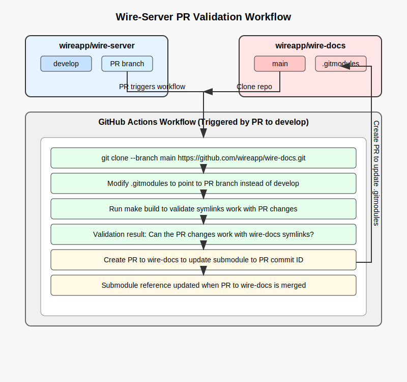

# docs 

- This directory contains only files that have been modified within the past year (since February 19, 2025). All older files have been moved to the [wire-docs](https://github.com/wireapp/wire-docs) repository. 

- These files are included in the wire-docs repository as a submodule and are pulled during the build process. They are essential for constructing the complete Wire documentation site. Any changes to these files should be made here, while updates to the older files (not present here anymore) should be committed directly to the wire-docs repository.

- The Markdown (.md) pages in this directory should be self-contained, including any static images or diagrams. However, please note that links within these documents may not function correctly, as they are relative to the `wireapp/wire-docs/src` directory. To ensure that document links work as intended, collaborate with the `wire-docs` repository to identify their correct locations.

- [build workflow](../.github/workflows/build.yaml):
    - This workflow automates documentation validation between the wire-server and wire-docs repositories. 
    
    - When a PR is made to wire-server's develop branch, GitHub Actions clones wire-docs and temporarily modifies its .gitmodules to point to the PR branch instead of develop. It then runs a build process to validate that the documentation changes work correctly with wire-docs' symlink structure.

    -  If validation passes, the workflow creates a second PR to wire-docs that updates the submodule reference to point to the specific commit ID from the original PR. 
    
    - This dual-PR approach ensures that documentation changes are fully tested before being merged and maintains version stability by pinpointing exact commits rather than following branches.

