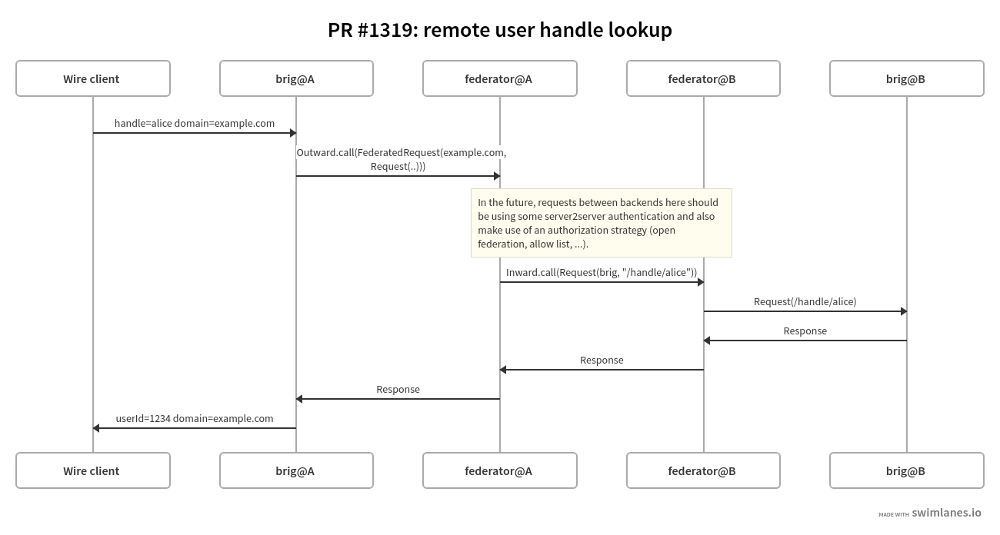

This PR #1319 is one small piece in the context of Federation, namely code for the first few bytes to travel from one backend to another backend. The example implemented here is exact handle search as per https://wearezeta.atlassian.net/browse/SQCORE-108

For general context about federation design, see (sorry non-Wire employees, this documentation will eventually be made available) https://github.com/wearezeta/documentation/blob/master/topics/federation/federation-design.md

This introduces the [mu-haskell](https://higherkindness.io/mu-haskell/) set of libraries as a new stack dependency to gain support in wire-server for http2 / GRPC (based on protobuf).

We make use of GRPC as a protocol as a new intra-service call internally from `brig` to `federator` (for the reverse flow from `federator` to `brig` we still use a REST API for the time being to not change too much at once), and also as a protocol between backends.

The following networking flow is implemented:

(to modify this diagram, see the swimlanes.io [source](../img/remote_user_handle_lookup.swimlanes.io.txt))

1. A component (e.g. 'brig') will send some data of type 'FederatedRequest' to
the 'federator' server (more precisely: the 'Outward' service part of the federator) within a same private network.
2. The federator will use the domain from the 'FederatedRequest' to discover
where to send some data of type 'Request' to.
3. On the other side, a publicly exposed 'Inward' service (also co-hosted on the
federator) will turn the received 'Request' into a 'Response' by making a call to a
component (e.g. brig) on its private network.

See also [libs/wire-api-federation/proto/router.proto]() for details of the grpc protocol.

Note: Server-server authentication is not yet implemented, so this code uses plain TCP between different backends at this point. This should be okay for the time being, since:
- the federator component is disabled by default in the wire-server helm chart and won't be "accidentally" installed
- we do not, and do not plan to run the federator in staging or production for the time being until much more of federation has been implemented: any request from brig to federator thus always fails with a 404 or other error client-side at this point.
- (instead we will have separate federation playground servers)

The core types allowing an easy extension of this code to support other requests and endpoints than the handle lookup can be found in libs/wire-server-api (notably the `proto/router.proto` file).
