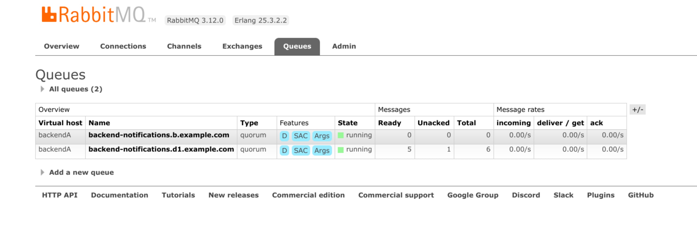

# RabbitMQ Consumer

`rabbitmq-consumer` can be used to inspect and drop blocking messages from a RabbitMQ queue containing outgoing messages to another backend.

E.g. in the following screen shot of the RabbitMQ management UI you can see that a message is stuck in the `backend-notifications.d1.example.com` queue:



## Interactively inspect/drop messages

Follow these steps to inspect (and/or drop) the message:

1. Stop the background-worker because the queues are single active consumer queues. One way to do this is to set the background-worker's `replicas` count to 0 in the k8s deployment. The number of unacked messages should then switch to 0.

2. Run:

```shell
RABBITMQ_HOST=<host> # default: "localhost"
RABBITMQ_PORT=<port> # default: 5672
RABBITMQ_USER=<user>
RABBITMQ_PW=<password>
RABBITMQ_VHOST=<vhost> # default: "/"
RABBITMQ_QUEUE=<queue>
WIRE_VERSION=<version>

docker run -it --network=host "quay.io/wire/rabbitmq-consumer:$WIRE_VERSION" \
  --host "$RABBITMQ_HOST" \
  --port "$RABBITMQ_PORT" \
  --username "$RABBITMQ_USER" \
  --password "$RABBITMQ_PW" \
  --vhost "$RABBITMQ_VHOST" \
  --queue "$RABBITMQ_QUEUE" \
  interactive
```

The output will look similar to:

```
vhost: backendA
queue: backend-notifications.d1.example.com
timestamp: Nothing
received message:
{
    "body": {
        "conversation": "7d86646e-1122-4979-8629-22dbd6e22afe",
        "data": "",
        "priority": null,
        "push": true,
        "recipients": {
            "d0c931d3-ee12-43e5-8c97-26f5b9b1ee6d": {
                "ea035ddd6d9647d5": "c3VjY2VzcyBtZXNzYWdlIGZvciBkb3duIHVzZXI="
            }
        },
        "sender": {
            "domain": "example.com",
            "id": "83c78b82-545d-4f29-aec4-ae29ea5231d0"
        },
        "sender_client": "550d8c614fd20299",
        "time": "2023-10-17T10:39:46.38476388Z",
        "transient": false
    },
    "ownDomain": "example.com",
    "path": "/on-message-sent",
    "targetComponent": "galley"
}
type 'drop' to drop the message and terminate, or press enter to terminate without dropping the message
```

Now the message can be dropped by typing: `drop`.

## Non-interactive commands

There are 2 non-interactive commands:

- `head`: prints the first message in the queue
- `drop-head (-a|--path PATH)`: drops the first message from the queue if the provided path argument matches the path field of the message

These commands will time out (after 10 seconds per default) if no messages are received within this time.
This can happen when the queue is empty, or when we lose the single active consumer race.

## Help

```shell
WIRE_VERSION=<version>

docker run -it --network=host "quay.io/wire/rabbitmq-consumer:$WIRE_VERSION" --help
```

```
rabbitmq-consumer

Usage: rabbitmq-consumer [-s|--host HOST] [-p|--port PORT]
                         [-u|--username USERNAME] [-w|--password PASSWORD]
                         [-v|--vhost VHOST] [-q|--queue QUEUE]
                         [-t|--timeout TIMEOUT] COMMAND

  CLI tool to consume messages from a RabbitMQ queue

Available options:
  -h,--help                Show this help text
  -s,--host HOST           RabbitMQ host (default: "localhost")
  -p,--port PORT           RabbitMQ Port (default: 5672)
  -u,--username USERNAME   RabbitMQ Username (default: "guest")
  -w,--password PASSWORD   RabbitMQ Password (default: "alpaca-grapefruit")
  -v,--vhost VHOST         RabbitMQ VHost (default: "/")
  -q,--queue QUEUE         RabbitMQ Queue (default: "test")
  -t,--timeout TIMEOUT     Timeout in seconds. The command will timeout if no
                           messages are received within this time. This can
                           happen when the queue is empty, or when we lose the
                           single active consumer race. (default: 10)

Available commands:
  head                     Print the first message in the queue
  drop-head                Drop the first message in the queue
  interactive              Interactively drop the first message from the queue
```
