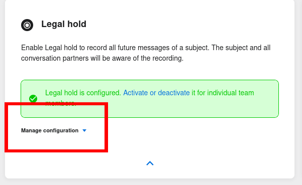

# Installing and setting up Legal Hold

## Introduction

Legal Hold is a service allowing for all communications of specific users of a Wire installation to be recorded in a secure vault, typically for legal reasons.

The Legal Hold service is composed of three different sub-services:

* Collector, which collects the conversations from individual users
* Exporter, which exports the conversations for storage
* Hold, which holds the conversation after Collector collects them, and before Exporter exports them

A typical installation of Legal Hold looks like this:

1. The Legal Hold service/container is installed and run on a server
2. The Teams Settings for the team that will use Legal Hold is configured to use this service
3. Specific users in that team are selected to have Legal Hold activated
4. These users are asked to confirm that they are aware of the information collection. Once they do, Legal Hold is active for their account.
5. Information starts being collected by the Collector service and stored by the Hold service

## Installing Legal Hold

To install and run Legal Hold, you need a server dedicated to the service. 

Here we will use Ubuntu 18.04 as it is the system wire-server is installed on, but other systems should be possible.

First, we need to install postgreSQL:

```bash
    sudo apt update
    sudo apt install postgresql
```

You then need to change the password to the database. First enter the PostgreSQL console:

```bash
   sudo -u postgres psql
```

Then use this command to change the password:

```sql
   ALTER USER postgres PASSWORD '<your-postgresql-password>';
```

Also create a `legalhold` database:

```sql
   CREATE DATABASE legalhold;
```

Now that we have a working PostgreSQL database, we need to install the actual legalhold services.

First install Git and Docker:

```bash
    sudo apt update
    sudo apt install docker.io
```

Generate a random secret (`SERVICE_TOKEN`) to use as your service token. This will be used in the Team Settings step later when entering configuration.

Here we will use `secr3t` as an example, however you can for example use this command to generate one:

```bash
   openssl rand -hex 20
```

Finally, run the actual Docker container for the LegalHold service:

```bash
    docker run \
    -e DB_URL='jdbc:postgresql://localhost/legalhold' \
    -e DB_USER='postgres' \
    -e DB_PASSWORD='your-postgresql-password' \
    -e SERVICE_TOKEN='secr3t' \
    -p 80:8080 \
    --name secure-hold --rm quay.io/wire/legalhold:1.0.4
```

* `DB_URL` is the URL of your PostgreSQL database.

Now that the legalhold service is running, you need to configure the DNS for your domain so that `legal.<yourdomain>` redirects to this service.

Make sure you implement/enable HTTPS, and remember your TLS public key (in PEM format) as it will be necessary in the Team Settings configuration.

## Configuring Team Settings to use Legal Hold

The next step is to configure the Wire Team, in the Team Settings interface, to interface with the newly installed Legal Hold service.

To do this, first go to  `teams.<your-domain>`.

Once in the interface, select `Customization` in the menu on the left:

<div style=" display: block; margin-left: auto; margin-right: auto; width: 75%;">


</div>


On the customization page, go to `Legal Hold`:

<div style=" display: block; margin-left: auto; margin-right: auto; width: 75%;">


</div>

Under the Legal Hold section, click the small down-pointing blue arrow:

<div style=" display: block; margin-left: auto; margin-right: auto; width: 75%;">


</div>

In the extended Legal Hold section, click on `Manage Configuration`:

<div style=" display: block; margin-left: auto; margin-right: auto; width: 75%;">



</div>

From here, you can fill in the required configuration info:

<div style=" display: block; margin-left: auto; margin-right: auto; width: 75%;">


</div>

Here, fill in the different fields:

* `Service URL` is the domain you set up in the first step: `https://legal.<your-domain>`
* `Authentication token` is the token you created in first step, we used `secr3t` as an example, but you might have generated a random token with `openssl rand -hex 20`
* `Public Key` is the TLS public key (in PEM format) for the certificate you generated when implementing HTTPS in the first step.

Finally, click on `Save`.

Here is the entire process animated:


