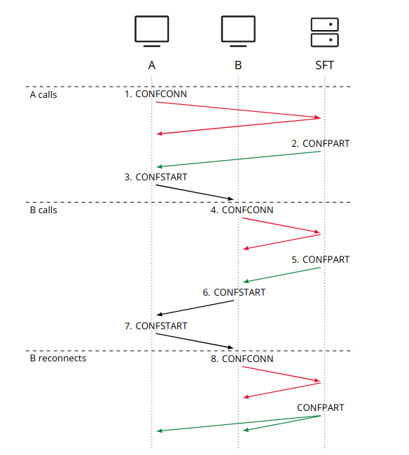

.. _understand-sft:

Conference Calling 2.0 (aka SFT)
================================

Background
----------

Previously, Wire group calls were implemented as a mesh, where each participant was connected
to each other in a peer-to-peer fashion. This meant that a client would have to upload their
video and audio feeds separately for each participant. This in practice meant that the amount
of participants was limited by the upload bandwidth of the clients.

Wire now has a signalling-forwarding unit called `SFT <https://github.com/wireapp/wire-avs-service>`__ which allows clients to upload once and
then the SFT fans it out to the other clients. Because connections are not end-to-end anymore now, dTLS encryption offered by WebRTC is not enough anymore as the encryption is terminated at the server-side. To avoid Wire from seeing the contents of calls SFT utilises WebRTC InsertibleStreams to encrypt the packets a second time with a group key that is not known to the server.

With SFT it is thus possible to have conference calls with many participants
without compromising end-to-end security.

.. note::
   We will describe conferencing first in a single domain in this section. 
   Conferencing in an environment with Federation is described in the
   :ref:`federated conferencing<federated-sft>` section.

Architecture
------------

The following diagram is centered around SFT and its role within a calling setup. Restund is seen
as a mere client proxy and its relation to and interaction with a client is explained
:ref:`here <understand-restund>`. The diagram shows that a call resides on a single SFT instance
and that the instance allocates at least one port for media transport per participant in the call.

.. figure:: img/architecture-sft.png

    SFT signaling, and media sending from the perspective of one caller

Establishing a call
-------------------

1. *client `A`* wants to initiate a call. It contacts all the known SFT servers via HTTPS.
   The SFT server that is quickest to respond is the one that will be used by the client.
   (Request 1: ``CONFCONN``)
2. *client `A`* gathers connection candidates (own public IP, public IP of the network the
   client is in with the help of STUN, through `TURN` servers) [1]_ for the SFT server to
   establish a media connection to *client `A`*. These information are then being send again
   from *client `A`* to the chosen SFT server via HTTPS request. (Request 2: ``SETUP``)
3. The SFT server tests which of the connection candidates actually work. Meaning, it
   goes through all the candidates until one leads to a successful media connection
   between itself and *client `A`*
4. *client `A`* sends an end-to-end encrypted message [2]_ ``CONFSTART`` to all members of chat, which contains
   the URL of the SFT server that is being used for the call.
5. Any other client that wants to join the call, does 1. + 2. with the exception of **only**
   contacting one SFT server i.e. the one that *client `A`* chose and told all other
   potential participants about via ``CONFSTART`` message

At that point a media connection between *client `A`* and the SFT server has been established,
and they continue talking to each other by using the data-channel, which uses the media
connection (i.e. no more HTTPS at that point). There are just 2 HTTPS request/response
sequences per participant.

.. [1] STUN & `TURN` are both part of a :ref:`Restund server <understand-restund>`
.. [2] This encrypted message is sent in the same conversation, hidden from user's view but
       interpreted by user's clients. It is sent via backend servers and forwarded to other
       conversation participants, not to or via SFT.

Prerequisites
-------------

For Conference Calling to function properly, clients need to be able to reach the HTTPS interface
of the SFT server(s) - either directly or through a load balancer sitting in front of the servers.
This is only needed for the call initiation/joining part.
Additionally, for the media connection, clients and SFT servers should be able to reach each other
via UDP (see :ref:`Firewall rules <install-sft-firewall-rules>`).
If that is not possible, then at least SFT servers and Restund servers should be able to reach each
other via UDP - and clients may connect via UDP and/or TCP to Restund servers
(see :ref:`Protocols and open ports <understand-restund-protocal-and-ports>`), which in
`TURN` will connect to the SFT server.
In the unlikely scenario where no UDP is allowed whatsoever or SFT servers may not be able to reach
the Restund servers that clients are using to make themselves reachable, an SFT server itself can
also choose to proxy itself by a Restund server, which could be different from the Restund servers
used by clients (see *`TURN` discovery* flag).

The SFT may need to receive and send traffic over UDP and TCP on a wide range of ports.
Due to the fact that Kubernetes services do not support setting port ranges, and Kubernetes pods not being publicly routable (at least in IPv4) we require the SFT pods to run in `hostNetwork` mode and the pod will bind directly to the default interface of the node.

Due to this `hostNetwork` limitation only one SFT instance can run per node so if you want to scale up your SFT deployment you will need to increase the amount of kubernetes nodes in your cluster.

As a rule of thumb you will need 1vCPU of compute per 50 participants. SFT will utilise multiple cores. You can use this rule of thumb to decide how many kubernetes nodes you need to provision.

For more information about capacity planning and networking please refer to the `technical documentation <https://github.com/wireapp/wire-server/blob/eab0ce1ff335889bc5a187c51872dfd0e78cc22b/charts/sftd/README.md>`__

.. _sft-protocol:

Protocol 
--------

This section provides a high-level description of the SFT protocol.

Calling
~~~~~~~

Calling in Wire comes in two flavors: **one-to-one calls** and **conference calls**.

One-to-one calls are calls between two clients, whereas conference calls can host more than two clients.

Both flavors have the same technological foundation and heavily rely on `WebRTC <https://webrtc.org/>`__ for media encoding/decoding, encryption and media routing.

Conference calls use an additional server-side component (Selective Forwarding `TURN` Server) as well as an additional encryption method.

Call signaling
..............

All calls are initiated through the `E2EE` session.

Call signalling parameters to establish a connection between Wire endpoints and negotiating their common capabilities is done by exchanging `SDP` ( `Session Description Protocol <https://en.wikipedia.org/wiki/Session_Description_Protocol>`__ ) messages.

For one-to-one calls, these messages are sent between clients as `E2EE` messages, using the same encryption as text messages.

In the case of conference calls, `SDP` messages are sent as `HTTPS` messages between a client `A`nd a Selective Forwarding `TURN` (SFT) server.

Media transport
...............

Once connected, endpoints determine a transport path for the media between them.

Whenever possible the endpoints allow direct media flow between them, however some networks may have a topology (e.g. with firewalls or NATs) preventing direct streaming and instead require the media to be relayed through a `TURN` server.

`ICE` ( `Interactive Connectivity Establishment <https://en.wikipedia.org/wiki/Interactive_Connectivity_Establishment>`__ ) identifies the most suitable transport path.

`TURN` servers are part of the Wire backend infrastructure but are standalone components that are not connected to the rest of the backend components and therefore do not share data with them.

They do not know the user ID of the users that use them and act purely as relay servers for media streams.

Clients use generic credentials to authenticate against the `TURN` servers, so that calls are indistinguishable for `TURN` servers.

Therefore, `TURN` servers cannot log identifiable call records.

`TURN` servers and the backend only share a long-term secret key that is used to symmetrically sign the generic credentials used by the clients to authenticate to the `TURN` server.

The credentials are emitted by the backend.

They expire after 24 hours and need to be refreshed by the clients.

The `TURN` server can verify the signature with the long-term secret key.

The purpose of these credentials is to prevent DoS ( `Denial Of Service <https://en.wikipedia.org/wiki/Denial-of-service_attack>`__ ) attacks against the `TURN` server.

In the case of a conference call the client starting the conference transmits the `TURN` servers and credentials to the SFT server as SFT servers do not have their own connection to the backend.

Encoding
........

The codec used for streaming is `Opus <https://en.wikipedia.org/wiki/Opus_(audio_format)>`__ for audio and `VP8 <https://en.wikipedia.org/wiki/VP8>`__ for video.

Opus can use variable bit rate encoding (`VBR <https://en.wikipedia.org/wiki/Variable_bitrate>`__) or constant bitrate encoding (`CBR <https://en.wikipedia.org/wiki/Constant_bitrate>`__).

Users can choose to enforce `CBR` in one-to-one calls in the settings.

Conference calls always use `CBR` encoding.

In custom builds of Wire it is possible to enforce the `CBR` option for one-to-one calls, too and remove this option for the users.

`CBR` has the advantage of eliminating potentially undesired information about packet length but might have an impact on call quality on slow networks.

It is sufficient if one of the two parties of a call enables the `CBR` option, `CBR` will then always be used for calls of that user.

When `CBR` is used, the calling screen will display `CONSTANT BIT RATE`.

In video calls the CBR option affects the audio streams like in audio calls, but the calling screen will not display `CONSTANT BIT RATE`.

One-on-One calls
~~~~~~~~~~~~~~~~

Call setup example
..................

The following is an example for setting up a one-to-one call with client `A` calling client `B`.

Client `A` connects to `TURN` server A and client `B` to `TURN` server B.

In practice these two `TURN` servers could be the same server.

The separation was chosen to reflect the fact that the external side of the `TURN` servers connects via `UDP`.

Clients may also directly connect via UDP to either other clients that are directly reachable or to a `TURN` server that a client is connected to.

   client `A` connecting with client `B` via `TURN` server A and `TURN` server B

Before a call can be set up, clients need to receive a call configuration from their associated backend.

This configuration is received when clients come online after they were offline for a longer time and it is frequently refreshed while being online.

The refresh interval (TTL, `Time To Live <https://en.wikipedia.org/wiki/Time_to_live>`__) can be set on the backend and is transmitted to clients in the configuration.

The configuration contains all available `TURN` servers, credentials to connect to the `TURN` server, and all available transport protocols.

`TURN` servers can be configured to allow any combination out of `UDP`, `TCP`, and `TLS`.

They are listening on the following ports:

* `3478` for `UDP`
* `3478` for `TCP`
* `5349` for `TLS`

For conference calls the call configuration also contains `URL`s to `SFT` servers.

To allow for load balancing over multiple `SFT` servers on the backend side, the call configuration is refreshed immediately before starting a conference call.

This way the backend can always distribute `SFT` servers with available capacity for a conference.

A typical call configuration for one `TURN` server and all transports, and one `SFT` server received by clients may look like this:

.. code-block::
   :caption: Example call configuration

      {
      "ttl": 3600,
      "ice_servers": [
      {
         "urls": ["turn:turn01.de.somedomain.com:3478?transport=udp"],
         "credential":"qvt5kHU7vQ5HK6JxihBIFY60fVm8FTFiRlv2LKdOJi6LX8yauMoXGSzRY/6MEokaCFerNWkbNyYh02ngOXFtgA==",
         "username":"d=1618436350.v=1.k=0.t=s.r=olgeadtuaoxmtkhz"
      },
      {
         "urls": ["turns:turn01.de.somedomain.com:5349?transport=tcp"],
         "credential": "QanQMQZvRZwQmojx3D/78lsZZLGwbGabqTOREUigf2vihwuSppWMz9PIytkvbBTyjDYR21/79coGJ8ZJ/3l9Og==",
         "username": "d=1618436350.v=1.k=0.t=s.r=ogmdrqxmirpaiyss"
      },
      {
         "urls": ["turn:turn01.de.somedomain.com:3478?transport=tcp"],
         "credential": "e2snEvOH1mWaUgWaYvXG5i53XymAhJQWxENNLK5GDBoeTnAo8rb9Ne+pfSgG16WeyQqHSBVAXbaeZ3kzVWN0NQ==",
         "username": "d=1618436350.v=1.k=0.t=s.r=pekwyrmcocpgicqq"
      }],
      "sft_servers": [
      {
         "urls": ["https://sft01.sft.somedomain.com:443"]
      }]
      }

In the above example, client `A` would receive a call configuration from the backend that includes `TURN` server A in combination with `UDP`, `TCP`, and `TLS` transport.

On the other side, client `B` would receive a similar call configuration from the backend as well that includes `TURN` server B.

.. note::

   Note that neither client `A` or B has or requires any knowledge about the call configuration on the other side (B or A) at the time a call is initiated.

.. note::

   Also note that even though the example above only shows one `TURN` server, for redundancy reasons, there might be multiple `TURN`, and multiple `SFT` servers provided in the configuration.

   Signaling flow during call setup phase.

When client `A` sets up a call to client `B`, it contacts all `TURN` servers that were listed in the call configuration, in the above example `TURN` server `A`, with an allocation request.

`TURN` server `A` then allocates and returns a UDP port on the “external” network for client `A`.

Client `A` now is reachable from the outside via the tuple of external IP address of `TURN` server `A` and the allocated UDP port.

All data that is sent to this tuple will be forwarded to client `A`.

The next step in the call setup process is to send this allocated tuple to client `B` in a call setup message via an `E2EE` message.

When client `B` receives the setup message it will run through the same procedure as client `A`.

Client `B` contacts `TURN` server `B` with an allocation request.

`TURN` server `B` then allocates and returns a `UDP` port on the «external» network for client `B`.

Client `B` at this point is reachable from the outside via the tuple of external `IP` address of `TURN` server `B` and the allocated `UDP` port.

All data that is sent to this tuple will be forwarded to client `B`.

Client `B` sends this tuple to client `A` in an answer to the call setup message from client `A` via an `E2EE` message.

Now both clients, client `A` and client `B`, run through a connectivity check where they try to reach the other client on all possible routes.

Ways to reach the other client includes the `TURN` allocation, but also local address or server reflexive address may be included.

In the above example it is assumed that both clients reside in networks that are not directly reachable from the other side (or want to mask their IP addresses).

Therefore, a connection from client `A` will be established through `TURN` server `A` connecting to `TURN` server `B`, forwarded to client `B`.

Client `B` will connect through `TURN` server `B` to `TURN` server `A`, forwarded to client `A`.

A path between client `A` and client `B` has been established and both clients can start streaming media.

Calling in federated environments
.................................

A call between two federated participants is not different from a call between two participants on the same domain.

Both participants exchange connection capabilities as `E2EE` messages and setup their connection based on the available connection endpoints.

Federated backends may additionally provide `TURN` servers to provide external connectivity.

Conference calls
~~~~~~~~~~~~~~~~

This section specifies the end-to-end encryption (`E2EE`) used by the first version of the next generation conference calling system of Wire.

This version implements a base-line security that is comparable with other end-to-end encrypted conferencing solutions today.

The goal however is to move to an `sframe`-based solution on top of MLS.

All messages between clients are sent with the selected `E2EE` protocol and inherit the security properties accordingly, i.e. authenticity and end-to-end encryption.

Selective Forwarding TURN Server (SFT)
......................................

The `SFT` is the main component in the conference calling architecture.

Its job is to gather encrypted streams from each client and fan them out to the others over a single connection.

In order to establish a call, clients initially connect to the `SFT` server via `HTTPS` and exchanging connection information via `SDP`s in `SETUP` messages.

Once established, the `SFT` and clients exchange media and data-channel messages over `UDP`.

For clients that can not connect directly via `UDP` refer to previous sections on how clients may use `TURN` servers to connect to the `SFT` server.

The `HTTPS` connection between clients and the `SFT` uses the same `TLS` mechanism and parameters described earlier in the `TLS` section.

In that respect, the `SFT` acts as just another `REST`ful backend `API`.

Calling messages
................

Wire uses `JSON` for encoding calling messages.

Messages are sent via `HTTPS` post/response, via `E2EE` session or via the data channel between clients and the `SFT`.

Messages only relevant for current call participants are sent via targeted `E2EE` messages to clients in the ongoing call (only `Proteus` supports targeted messages, `MLS` uses a subgroup to send the message to all actively participating clients).

List of the messages used for establishing calls:

+------------+------------------------+------+-------+------------------------------------------------------------------------------------------------------+
| Message    | Transport              | Req  | Resp  | Description                                                                                          |
+============+========================+======+=======+======================================================================================================+
| `SETUP`    | `HTTPS`                | x    | x     | Contains SDP offer and answer for setting up connection to the SFT                                   |
+------------+------------------------+------+-------+------------------------------------------------------------------------------------------------------+
| `PROPSYNC` | `Data channel`         | x    | x     |  Used to inform clients of video send and mute status.	                                             |
+------------+------------------------+------+-------+------------------------------------------------------------------------------------------------------+
| `HANGUP`   | `Data channel`         | x    | x     | Used to disconnect a connection to the SFT in an orderly fashion.	                                 |
+------------+------------------------+------+-------+------------------------------------------------------------------------------------------------------+
| `CONFSTART`| `E2EE Protocol`        | x    | x     | Informs clients of the start of a call.                                                              |
+------------+------------------------+------+-------+------------------------------------------------------------------------------------------------------+
| `CONFEND`  | `E2EE Protocol`        | x    |       | Informs clients of the end of the call.	                                                            |
+------------+------------------------+------+-------+------------------------------------------------------------------------------------------------------+
| `CONFCONN` | `HTTPS`                | x    | x     | Establishes the connection for a call.	                                                            |
+------------+------------------------+------+-------+------------------------------------------------------------------------------------------------------+
| `CONFPART` | `Data channel`         | x    |       | Lists the participants in the call and their streams.                                                |
+------------+------------------------+------+-------+------------------------------------------------------------------------------------------------------+
| `CONFPART` | `Data channel`         |      | x     | Lists authorized participants.	                                                                     |
+------------+------------------------+------+-------+------------------------------------------------------------------------------------------------------+
| `CONFKEY`  |`Targeted E2EE message `| x    |       | Request for missing key in case of missed E2EE messages.	                                          |
+------------+------------------------+------+-------+------------------------------------------------------------------------------------------------------+
| `CONFKEY`  | Targeted E2EE message  |      | x     | Contains the encryption/decryption keys.	                                                            |
+------------+------------------------+------+-------+------------------------------------------------------------------------------------------------------+
| `CONFCHECK`| `E2EE Protocol`        |      |       | Sent periodically to inform inactive clients that the call is ongoing, fallback for missing CONFEND  |
+------------+------------------------+------+-------+------------------------------------------------------------------------------------------------------+

Starting and joining a call
...........................

This next figure shows the `HTTPS` calls (red), `E2EE` messages (black) and data channel messages (green) for a three party call, where client `A` starts the call, then client `B` joins and client `C` joins later.

   Message sequence for establishing a conference call

Step by step:

1. Client A starts a call, generates a random secret to be used to generate call and user-client IDs and connects to the SFT by sending a `CONFCONN` message over `HTTPS`.

2. The `SFT` responds with a `SETUP` message including the SDP offer.
   Client A then sends a `SETUP` response with the SDP answer and a connection started.
   The `SFT` responds with a `CONFCONN` response.

3. Once the connection is made the SFT sends a `CONFPART` over data-channel containing the participant list [A].
   Client A responds with a `CONFPART` response (removed from the diagram for simplicity).

4. The `SFT` indicates to client A that this is a new call, so client A sends a `CONFSTART` to all clients in the conversation, giving them the secret so they can also generate the IDs.

5. Client B answers the call and connects in the same manner but is told this is not a new call so doesn’t send a `CONFSTART`.

6. The `SFT` sends the updated participant list [A, B] to both clients.

7. Client A sees that B is a new client and sends a `CONFKEY` to client B so media can be encrypted and decrypted.

8. Client C joins in the same manner and the `SFT` sends `CONFPART` with participant list [A, B, C] to all clients.

9. Client A sees client C as a new client and sends a `CONFKEY` to client C also.

Conflict resolution
...................

If two clients try to initiate a call at the same time, they will generate different random secrets and end up in two different calls on the `SFT`.

To avoid this a conflict resolution procedure is in place.

This is resolved by the `SFT` passing a creation time and sequence number to the client in the `CONFPART` message.

This is relayed to the other clients in the `CONFSTART` message.

The call with the earliest creation-sequence value wins the conflict, the other client abandons the call and joins the newer one.

   Conflict resolution: Sequence of messages of a conflict (connection messages are simplified)

Step by step:

1. Client A starts a call (call 1) in the conversation in the same fashion as above.

2. The `SFT` passes a `CONFPART` message with the participant list for call 1: [A].

3. As this is a new call, client A sends a `CONFSTART` for call 1 to all clients in the conversation.

4. Client B, having not received the `CONFSTART` for call 1 yet, starts another call (call 2) in the conversation.

5. The `SFT` passes a `CONFPART` message with the participant list for call 2: [B].

6. As call 2 is a new call, client B sends a `CONFSTART` for call 2 to all clients in the conversation.

7. Client A receives the `CONFSTART` for call 2, compares the timestamp and sequence number and determines that call 1 was initiated earlier.
   Client A then resends the `CONFSTART` for call 1.

8. On receiving the `CONFSTART` for call 1, client B sees that call 1 was initiated earlier and abandons call 2, reconnecting to the `SFT` for call 1.

.. _federated-sft:

Federated Conference Calling 
============================

Conferencing in a federated environment assumes that each domain participating in a 
conference will use an SFT in its own domain. The SFT in the caller's domain is called
the `anchor SFT`. 

Multi-SFT Architecture
----------------------

With support for federation, each domain participating in a conference is responsible to
make available an SFT for users in that domain.  The SFT in the domain of the caller is
called the `anchor SFT`. SFTs in other domains (in the same conference) connect to the
anchor SFT.  Non-anchor SFTs drop their connection to the anchor SFT when no local
participants are present. The anchor SFT does not destroy the conference until there are
no participants (federated SFTs or local clients).

The following diagram shows SFTs in two different domains. In this example, Alice
initiates a call in a federated conversation which contains herself, Adam also in domain
A, and Bob and Beth in domain B. Alice's client first creates a conference and is
assigned a conference URL on SFT A2. Because the SFT is configured for federation, it
assumes the role of anchor and also returns an IP address and port (the `anchor SFT tuple`)
which can be used by any federated SFTs which need to connect. (Alice sets up her media 
connection with SFT A2 as normal).

Alice's client forwards the conference URL and the anchor SFT tuple to the other
participants in the conversation, end-to-end encrypted.  Bob's client examines the
conference URL. Realizing this URL is not an SFT in its own domain, Bob's client opens
a connection to its SFTs as if creating a new connection, but passes an additional
parameter containing the anchor SFT URL and tuple. SFT B1 establishes a DTLS connection
to the anchor SFT using the anchor SFT tuple and provides the SFT URL. (Bob's client
also sets up media with SFT B1 normally.)  At this point all paths are established
and the conference call can happen normally.

.. figure:: img/multi-sft-noturn.png

    Basic Multi-SFT conference initiated by Alice in domain A, with Bob in domain B

Because some customers do not wish to expose their SFTs directly to hosts on the public
Internet, the SFTs can allocate a port on a `TURN` server. In this way, only the IP
addresses and ports of the `TURN` server are exposed to the Internet. This can be a separate
set of `TURN` servers from those used for ordinary client calling. The diagram below shows
this scenario.  In this configuration, SFT A2 requests an allocation from the federation
`TURN` server in domain A before responding to Alice. The anchor SFT tuple is the address
allocated on the federation `TURN` server in domain A.

.. figure:: img/multi-sft-turn.png

    Multi-SFT conference with `TURN` servers between federated SFTs

Finally, for extremely restrictive firewall environments, the `TURN` servers used for
federated SFT traffic can be further secured with a `TURN` to `TURN` mutually
authenticated DTLS connection. The SFTs allocate a channel inside this DTLS connection
per conference.  The channel number is included along with the anchor SFT tuple
returned to Alice, which Alice shares with the conversation, which Bob sends to SFT B1,
and which SFT B1 uses when forming its DTLS connection to SFT A2. This DTLS connection 
runs on a dedicated port number which is not used for regular `TURN` traffic. Under this
configuration, only that single IP address and port is exposed for each federated TURN
server with all SFT traffic multiplexed over the connection. The diagram below shows
this scenario.  Note that this `TURN` DTLS multiplexing is only used for SFT to SFT
communication and does not affect the connectivity requirements for normal one-on-one
calls.

.. figure:: img/multi-sft-turn-dtls.png

    Multi-SFT conference with federated `TURN` servers with DTLS multiplexing

