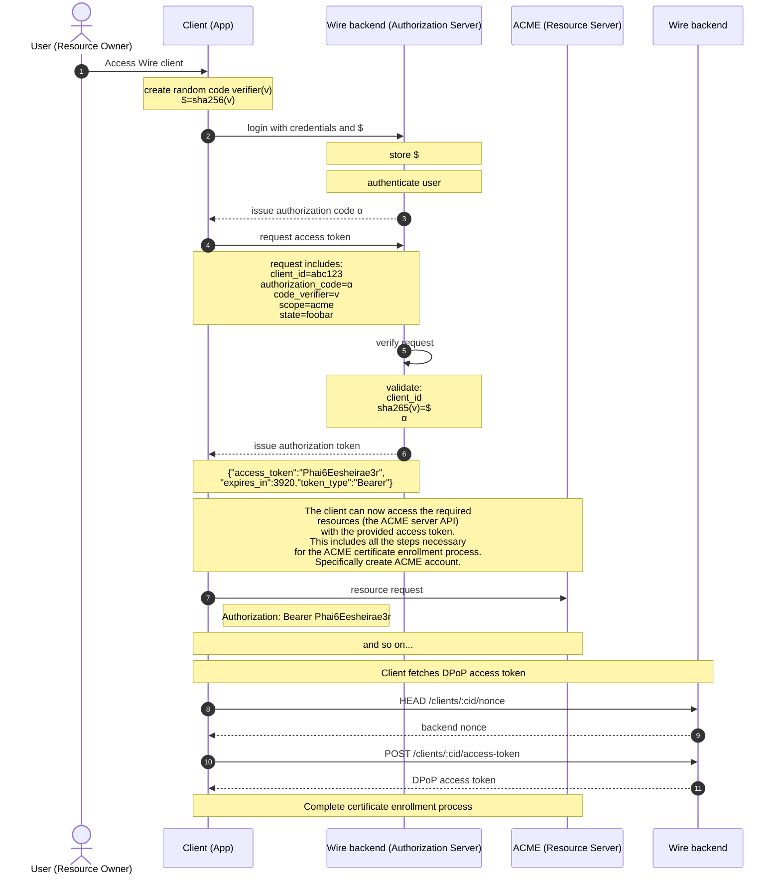

# End-to-end client identity certificate enrollment (OAuth & OIDC)

## Roles

### The Third-Party Application: "Client" or "App"

> The client is the application that is attempting to get access to the user's account. It needs to get permission from the user before it can do so.

In our use case this is the *Wire client* or *device*.

### The API: "Resource Server"

> The resource server is the API server used to access the user's information.

The resource server is the *ACME server* and the resources the client requires access to is the ACME server API.

### The Authorization Server

> This is the server that presents the interface where the user approves or denies the request. In smaller implementations, this may be the same server as the API server, but larger scale deployments will often build this as a separate component.

The *Wire backend*.

### The User: Resource Owner

> The resource owner is the person who is giving access to some portion of their account.

A user with a Wire account.

### Scope

The ACME server API.

## Sequence Diagram - OAuth only (Device Authorization Grant & OIDC)

### Questions

- 2,3: Do we really need to get the authorization request from the ACME server? Maybe the client create the request itself?
- What type of authorization grant are we going to use?
  - Maybe *client credential* (back channel only, recommended for machine to machine/service communication)
- How do we set up client credentials
