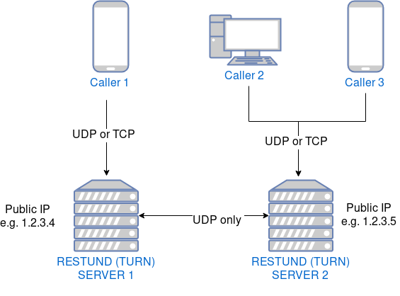

Restund (TURN) servers
========================

Introduction
~~~~~~~~~~~~

Restund servers allow two users on different private networks (for
example Alice who is in an office connected to an office router and Bob
who is at home connected to a home router) to have a Wire audio or video
call. More precisely:

   Restund is a modular and flexible
   `STUN <https://en.wikipedia.org/wiki/STUN>`__ and
   `TURN <https://en.wikipedia.org/wiki/Traversal_Using_Relays_around_NAT>`__
   Server, with IPv4 and IPv6 support.

.. _architecture-restund:

Architecture
~~~~~~~~~~~~

Since the restund servers help establishing a connection between two
users, they need to be reachable by both of these users, which usually
means they need to have a **public IP address**.

While one server is enough to get started, two servers provide
high-availability in case one server gets into trouble.

You can either have restund servers directly exposed to the public
internet:

|architecture-restund|

Or you can have them reachable by fronting them with a firewall or load
balancer machine that may have a different IP than the server where
restund is installed:

|architecture-restund-lb|

Protocols and open ports
~~~~~~~~~~~~~~~~~~~~~~~~

UDP
^^^

Restund servers provide the best audio/video connections if end-user
devices can connect to them via UDP. In this case, a firewall (if any)
needs to allow and/or forward the complete UDP port range ``1024-65535``
for incoming UDP traffic. Port ``3478`` is the default control port,
however one UDP port per active connection is required, so a whole port
range must be available and reachable from the outside.

In case e.g. office firewall rules disallow UDP traffic, there is a
possibility to use TCP instead, at the expense of call quality.

TCP
^^^

Two (configurable) ports are used by restund for TCP, one for plain TCP
and one for TLS. By default restund uses ports ``3478`` for plain TCP
and port ``5349`` for TLS. You can instead use (if that's easier with
firewall rules) for example ports ``80`` and ``443`` (requires to run
restund as root) or do a redirect from a load balancer (if using one) to
redirect ``443 -> 5349`` and ``80 -> 3478``.

Amount of users and file descriptors
~~~~~~~~~~~~~~~~~~~~~~~~~~~~~~~~~~~~

Each allocation (active connection by one participant) requires 1 or 2
file descriptors, so ensure you increase your file descriptor limits in
case you have many users.

Currently one restund server can have a maximum of 64000 allocations. If
you have more users than that in an active call, you need to deploy more
restund servers.

Load balancing and high-availability
~~~~~~~~~~~~~~~~~~~~~~~~~~~~~~~~~~~~

Load balancing is not possible, since STUN/TURN is a stateful protocol,
so UDP packets addressed to ``restund server 1``, if by means of a load
balancer were to end up at ``restund server 2``, would get dropped, as
the second server doesn't know the source address.

High-availability is nevertheless ensured by having and advertising more
than one restund server.  Instead of the load balancer, the clients will
switch their server if it fails.

Discovery and establishing a call
~~~~~~~~~~~~~~~~~~~~~~~~~~~~~~~~~

A simplified flow of how restund servers, along with the wire-server are
used to establish a call:

|flow-restund|

DNS
~~~

Usually DNS records are used which point to the public IPs of the
restund servers (or of the respective firewall or load balancer
machines). These DNS names are then used when configuring wire-server.

.. |architecture-restund-lb| image:: img/architecture-restund-lb.png
.. |flow-restund| image:: img/flow-restund.png
