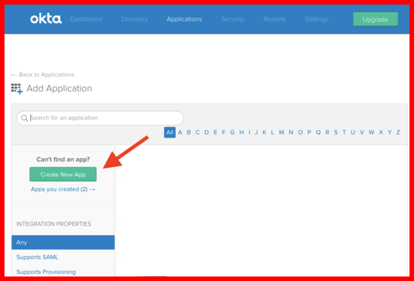
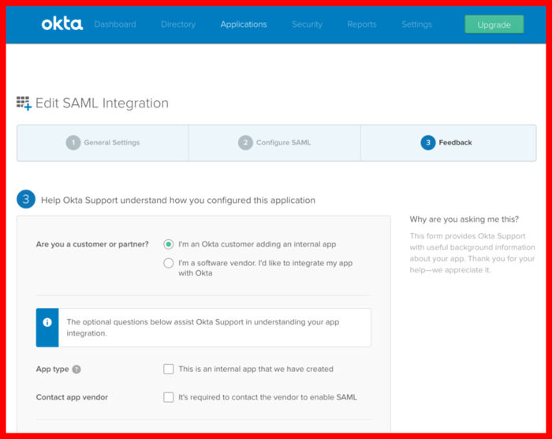

How to set up SSO integration with Okta
=======================================

Preprequisites
--------------

- http://okta.com/ account, admin access to that account
- See also :ref:`SSO generic setup`.

Steps
-----

Okta setup
~~~~~~~~~~

- Log in into Okta web interface
- Open the admin console and switch to the "Classic UI"
- Navigate to "Applications"
- Click "Add application"

.. image:: 001-applications-screen.png

----

- Create a new application

----

- Choose `Web`, `SAML 2.0`

.. image:: 003-add-application-1.png

----

- Pick a name for the application in "Step 1" and continue

.. image:: 004-add-application-step1.png

----

- Add the following parameters in "Step 2" and continue

+-----------------------------+------------------------------------------------------------------------------+
+ Paramenter label            | Value                                                                        |
+=============================+==============================================================================+
| Single Sign On URL          | `https://prod-nginz-https.wire.com/sso/finalize-login`                       |
+-----------------------------+------------------------------------------------------------------------------+
| Use this for Recipient URL  | checked ✅                                                                   |
| and Destination URL         |                                                                              |
+-----------------------------+------------------------------------------------------------------------------+
| Audience URI (SP Entity ID) | `https://prod-nginz-https.wire.com/sso/finalize-login`                       |
+-----------------------------+------------------------------------------------------------------------------+
| Name ID format              | `EmailAddress` (\*)                                                          |
+-----------------------------+------------------------------------------------------------------------------+
| Application Username        | `Email` (\*)                                                                 |
+-----------------------------+------------------------------------------------------------------------------+

**(\*) Note**: The application username **must be** unique in your team, and should be immutable once assigned. If more than one user has the same value for the field that you select here, those two users will log in as a single user on Wire. And if the value were to change, users will be re-assigned to a new account at the next login. Usually, `email` is a safe choice but you should evaluate it for your case.

.. image:: 005-add-application-step2.png

----

- Give the following answer in "Step 3" and continue

+-----------------------------------+------------------------------------------------------------------------+
+ Paramenter label                  | Value                                                                  |
+===================================+========================================================================+
| Are you a customer or a partner?  | I'm an Okta customer                                                   |
+-----------------------------------+------------------------------------------------------------------------+

----

- The app has been created. Switch to the "Sign-On" tab
- Find the "Identity Provider Metadata" link. Copy the link address (normally done by right-clicking on the link and selecting "Copy link location" or a similar item in the menu).
- Store the link address somewhere for a future step.

.. image:: 007-application-sign-on.png

----

- Switch to the "Assignments" tab
- Make sure that some users (or everyone) is assigned to the application. These are the users that will be allowed to log in to Wire using Single Sign On. Add the relevant users to the list with the "Assign" button.

.. image:: 008-assignment.png
