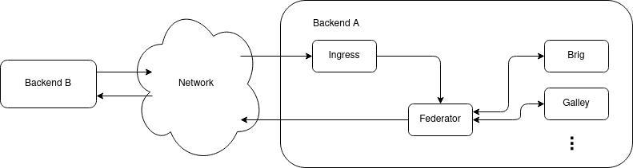
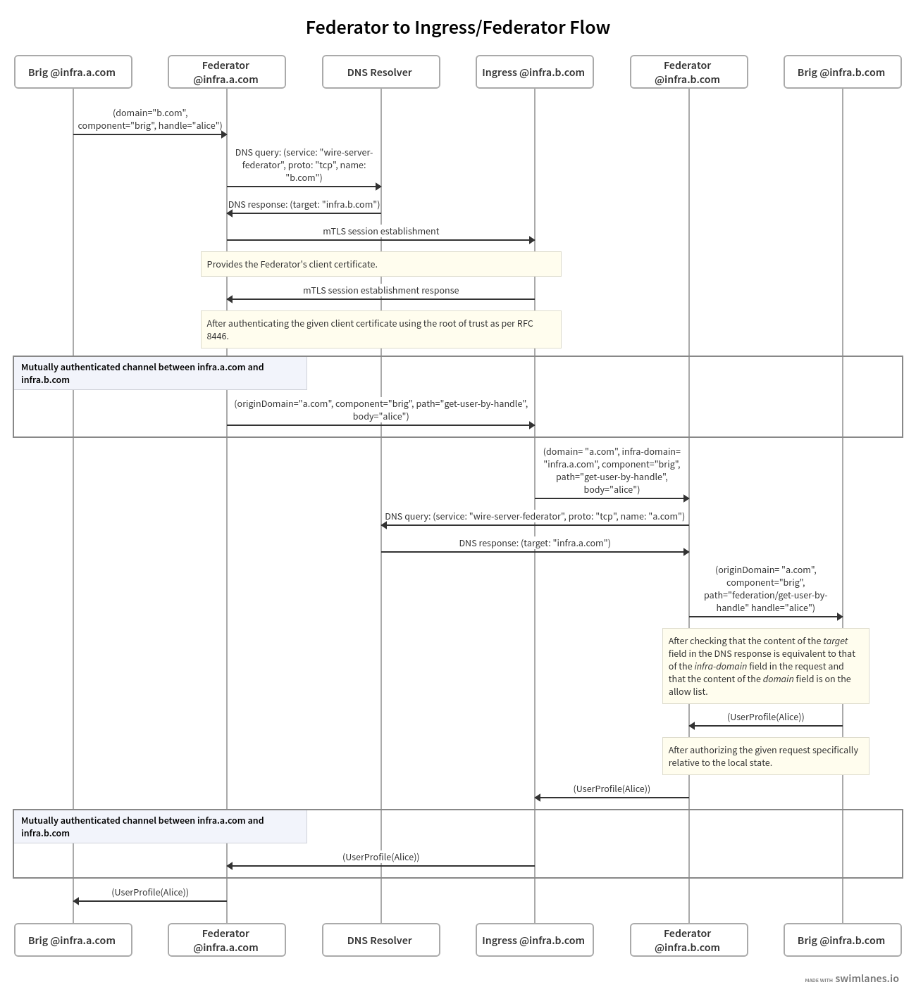

Architecture and Network
=========================

.. _federation-architecture:

Architecture
-------------

To facilitate connections between federated backends, two new components are
added to each backend: :ref:`Federation Ingress <federation_ingress>` and
:ref:`Federator <federator>`. The `Federation Ingress` is, as the name suggests
the ingress point for incoming connections from other backends, which are then
forwarded to the `Federator`. The `Federator` then further processes the
requests. In addition, the `Federator` also acts as *egress* point for requests
from internal backend components to other, remote backends.

Backend domains
^^^^^^^^^^^^^^^

Each backend has two domain strings: an `infrastructure domain` and a 
`backend domain`.

The `infrastructure domain` is the domain name under which the backend is 
actually reachable via the network. It is also the domain name that each 
backend uses in authenticating itself to other backends.

Similarly, there is the `backend domain`, which is used to qualify the names and
identifiers of users local to an individual backend in the context of
federation. For example, a user with (unqualified) user name `jane_doe` at a
backend with backend domain `company-a.com` has the qualified user name
`jane_doe@company-a.com`, which is visible to users of other backends in the
context of federation.

See :ref:`Qualified Identifiers and Names <qualified-identifiers-and-names>` for
more information on qualified names and identifiers.

The distinction between the two domains allows the owner of a (backend) domain
(e.g. `company-a.com`) to host their Wire backend under a different (infra)
domain (e.g. `wire.infra.company-a.com`).

Backend components
^^^^^^^^^^^^^^^^^^

In addition to the regular components of a Wire backend, two additional
components are added to enable federation with other backends: The `Federation
Ingress` and the `Federator`. Other Wire components use these two components to
contact other backends and respond to queries originating from remote backends.

The following subsections briefly introduce the individual components, their
state and their functionality. The semantics of backend-to-backend communication
will be explained in more detail in the Section on :ref:`Federation API
<federation-api>`.

.. _federation_ingress:

Federation Ingress
~~~~~~~~~~~~~~~~~~

The `Federation Ingress` is a `kubernetes ingress
<https://kubernetes.io/docs/concepts/services-networking/ingress/>`_ and uses
`nginx <https://nginx.org/en/>`_ as its underlying software.

It is configured with a set of X.509 certificates, which acts as root of trust
for the authentication of the infra domain of remote backends, as well as with a
certificate, which it uses to authenticate itself toward other backends.

Its functions are:

* terminate TLS connections

  - perform mutual :ref:`authentication` as part of the TLS connection
    establishment

* forward requests to the local :ref:`Federator <federator>` instance, along
  with the remote backend's client certificate

.. _federator:

Federator
~~~~~~~~~

The `Federator` performs additional authorization checks after receiving
federated requests from the `Federation Ingress` and acts as egress point for
other backend components. It can be configured to use an :ref:`allow list
<allow-list>` to authorize incoming and outgoing connections, and it keeps an
X.509 client certificate for the backend's infra domain to authenticate itself
towards other backends. Additionally, it requires a connection to a DNS resolver
to :ref:`discover<discovery>` other backends.

When receiving a request from an internal component, the `Federator` will:

#. If enabled, ensure the target domain is in the :ref:`allow list <allow-list>`
#. :ref:`discover <discovery>` the other backend,
#. establish a :ref:`mutually authenticated channel <authentication>` to the
   other backend using its client certificate,
#. send the request to the other backend and
#. forward the response back to the originating component (and eventually to the
   originating Wire client).

The `Federator` also implements the authorization logic for incoming requests and
acts as intermediary between the `Federation Ingress` and the internal
components. The `Federator` will, for incoming requests from remote backends
(forwarded via the local :ref:`Federation Ingress <federation_ingress>`):

#. :ref:`Discover <discovery>` the mapping between backend domain claimed by the
   remote backend and its infra domain,
#. verify that the discovered infra domain matches the domain in the remote
   backend's client certificate,
#. if enabled, ensure that the backend domain of the other backend is in the
   :ref:`allow list <allow-list>`,
#. normalize and sanitize the :ref:`path component <federator-component-api>` of
   the incoming request to ensure it's recognizable as a federated request and
#. forward requests to other wire-server components.

.. _other-wire-server:

Other wire-server components
~~~~~~~~~~~~~~~~~~~~~~~~~~~~

Components such as 'brig', 'galley', or 'gundeck' are responsible for actual
business logic and interfacing with databases and non-federation related
external services. See `source code documentation
<https://github.com/wireapp/wire-server>`_. In the context of federation, their
functions include:

* For incoming requests from other backends:  :ref:`per-request authorization<per-request-authorization>`
* Outgoing requests to other backends are always sent via a local :ref:`Federator` instance.

For more information of the functionalities provided to remote backends through
their `Federator`, see the :ref:`federated API documentation<api-endpoints>`.

Backend to backend communication
--------------------------------------------

We require communication between the `Federator` of one (sending) backend and
the ingress of another (receiving) backend to be both mutually authenticated and
authorized. More specifically, both backends need to ensure the following:

:Authentication: Determine the identity (infra domain name) of the other
                 backend.
:Discovery: Ensure that the other backend is authorized to represent the backend
            domain claimed by the other backend.
:Authorization: Ensure that this backend is authorized to federate with the
                other backend.

.. _authentication:

Authentication
^^^^^^^^^^^^^^

.. warning:: As of October 2021, the implementation of mutual backend-to-backend
             authentication is still subject to change. The behaviour described
             in this section should be considered a draft specification only.

Authentication between Wire backends is achieved using the mutual authentication
feature of TLS as defined in `RFC 8556 <https://tools.ietf.org/html/rfc8446>`_.

In particular, this means that the ingress of each backend needs to be
provisioned with one or more certificates which the ingress trusts to 
authenticate certificates provided by other backends when accepting incoming 
connections.

Conversely, every `Federator` needs to be provisioned with a (client)
certificate which it uses to authenticate itself towards other backends.

Note that the client certificate is expected to be issued with the backend's
infra domain as one of the subject alternative names (SAN), which is defined in
`RFC 5280 <https://tools.ietf.org/html/rfc5280>`_.

If a receiving backend fails to authenticate the client certificate, it should
reply with an :ref:`authentication error <authentication error>`.

.. _discovery:

Discovery
^^^^^^^^^

The discovery process allows a backend to determine the infra domain of a given
backend domain.

This step is necessary in two scenarios:

* A backend would like to establish a connection to another backend that it only
  knows the backend domain of. This is the case, for example, when a user of a
  local backend searches for a :ref:`qualified username <glossary_qualified-user-name>`,
  which only includes that user's backend's backend domain.
* When receiving a message from another backend that authenticates with a given
  infra domain and claims to represent a given backend domain, a backend would
  like to ensure the backend domain owner authorized the owner of the infra
  domain to run their Wire backend.

To make discovery possible, any party hosting a Wire backend has to announce the
infra domain via a DNS `SRV` record as defined in `RFC 2782
<https://tools.ietf.org/html/rfc2782>`_ with `service = wire-server-federator,
proto = tcp` and with `name` pointing to the backend's domain and `target` to
the backend's infra domain.

For example, Company A with backend domain `company-a.com` and infra domain
`wire.company-a.com` could publish

.. code-block:: bash

   _wire-server-federator._tcp.company-a.com. 600  IN  SRV 10 5 443 federator.wire.company-a.com.

A backend can then be discovered, given its domain, by issuing a DNS query for
the SRV record specifying the `wire-server-federator` service.

DNS Scope
~~~~~~~~~

The network scope of the SRV record (as well as that of the DNS records for
backend and infra domain), depends on the desired federation topology in the
same way as other parameters such as the availability of the CA certificate that
allows authentication of the `Federation Ingress`' server certificate or the
`Federator`'s client certificate. The general rule is that the SRV entry should
be "visible" from the point of view of the desired federation partners. The
exact scope strongly depends on the network architecture of the backends
involved.

SRV TTL and Caching
~~~~~~~~~~~~~~~~~~~

After retrieving the SRV record for a given domain, the local backend caches the
`backend domain <--> infra domain` mapping for the duration indicated in the TTL
field of the record.

Due to this caching behaviour, the TTL value of the SRV record dictates at which
intervals remote backends will refresh their mapping of the local backend's
backend domain to infra domain. As a consequence a value in the order of
magnitude of 24 hours will reduce the amount of overhead for remote backends.

On the other hand in the setup phase of a backend, or when a change of infra
domain is required, a TTL value in the magnitude of a few minutes allows remote
backends to recover more quickly from a change of infra domain.

.. _authorization:

Authorization
^^^^^^^^^^^^^

After an incoming connection is authenticated, a second step is required to
ensure that the sending backend is authorized to connect to the receiving
backend. As the backend authenticates using its infra domain, but the allow list
contains backend domains (which is not necessarily the same) the sending backend
also needs to provide its backend domain.

To make this possible, requests to remote backends are required to contain a
`Wire-Origin-Domain` header, which contains the remote backend's domain.

While the receiving backend has authenticated the sending backend as the infra
domain, it is not clear that the sending backend is indeed authorized by the
owner of the backend domain to host the Wire backend of that particular domain.

To perform this extra authorization step, the receiving backend follows the
process described in :ref:`discovery` and checks that the discovered infra
domain for the backend domain indicated in the `Wire-Domain` header is one of
the Subject Alternative Names contained in the sending backend's client
certificate. If this is not the case, the receiving backend replies with a
:ref:`discovery error <discovery error>`.

Finally, the receiving backend checks if the domain of the sending backend is in
the :ref:`allow-list` and replies with an :ref:`authorization error
<authorization error>` if it is not.

.. _allow-list:

Domain Allow List
~~~~~~~~~~~~~~~~~

Federation can happen between any backends on a network (e.g. the open
internet); or it can be restricted via server configuration to happen between a
specified set of domains on an 'allow list'. If an allow list is configured,
then:

* outgoing requests will only happen if the requested domain is contained in the allow list.
* incoming requests: if the domain of the sending backend is not in the allow
  list, any request originating from that domain is replied to with an
  :ref:`authorization error <authorization error>`

.. _per-request-authorization:

Per-request authorization
~~~~~~~~~~~~~~~~~~~~~~~~~

In addition to the general authorization step that is performed by the federator
when a new, mutually authenticated TLS connection is established, the component
processing the request performs an additional, per-request authorization step.

How this step is performed depends on the API endpoint, the contents of the
request and the context in which it is made.

See the documentation of the individual :ref:`API endpoints <api-endpoints>` for
details.

Example
^^^^^^^

The following is an example for the message and information flow between a
backend with backend domain `a.com` and infra domain `infra.a.com` and another
backend with backend domain `b.com` and infra domain `infra.b.com`.

The content and format of the message is meant to be representative. For the
definitions of the actual payloads, please see the :ref:`federation
API<federation-api>` section.

The scenario is that the brig at `infra.a.com` has received a user search
request from `Alice`, one of its clients.

..
  paths to images are currently listed at the end of the file. If you prefer to specify them directly in the paragraph they are used, that is also fine.
