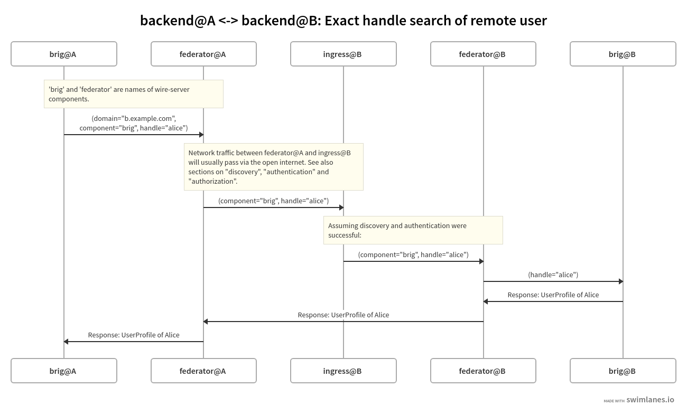

Architecture and Network
=========================

Architecture
-------------

Architecture diagram showing ingress, federator, brig TODO

Flow of information between server components
------------------------------------------------

Assuming two installations hosted on subdomains of ``a.example.com`` (A) and ``b.example.com`` (B).

Example of the network connections made between the components of two :ref:`backends <backend>` for a user search (*'exact handle search'*):

* The exact message objects shown in the above diagram are simplified to ease understanding of which components send bytes over the network to which other components. For the precise definitions of those bytes take a look at the :ref:`federation API<federation-api>`.
* Depending on the request made by user 1 registered on backend A, different :ref:`wire-server components <other-wire-server>` than 'brig' shown above will make a request over their local network to the 'federator' component.

Component responsibilities
---------------------------

.. _federator:

Federator
^^^^^^^^^

The 'federator' will, for outgoing requests to other backends:

#. If enabled, ensure the target domain is in the :ref:`allow list <allow-list>`
#. :ref:`discover <discovery>` the other backend
#. make an :ref:`authenticated call <authentication>` to the other backend
#. forward the response back to the originating component (and eventually to the originating Wire client)

The 'federator' will, for incoming requests from other backends (forwarded via the local :ref:`ingress`):

#. If enabled, ensure the originating domain is in the :ref:`allow list <allow-list>`
#. forward requests to other wire-server components (brig, galley, ...)

.. _ingress:

Ingress
^^^^^^^

The ingress is a `kubernetes ingress <https://kubernetes.io/docs/concepts/services-networking/ingress/>`_ and uses `nginx <https://nginx.org/en/>`_ as its underlying software. Its functions are:

* terminate TLS connections
* perform :ref:`authentication`
* forward requests to a local instance of the :ref:`federator`

.. _other-wire-server:

Other wire-server components
^^^^^^^^^^^^^^^^^^^^^^^^^^^^

Components such as 'brig', 'galley', or 'gundeck' are responsible for actual business logic and interfacing with databases and non-federation related external services. See `source code documentation <https://github.com/wireapp/wire-server>`_. In the context of federation, their functions include:

* For incoming requests from other backends: per-request :ref:`authorization`
* Outgoing requests to other backends are always sent via a local :ref:`federator` instance.

.. _discovery:

Discovery
----------

If a backend would like to send a request to a remote backend with a given
domain, for example because a user would like to send a message to a user on a
that backend, it first needs to 'discover' that backend. This step is necessary,
as backends are not necessarily hosted under the domain they represent.

The domain that a Wire backend represents, i.e. the domain that is present in
the qualified UIDs of its users is simply referred to as the backend's 'domain',
while the domain that the backend is hosted at is called `infrastructure domain`
(or 'infra domain' for short).

To make discovery possible, any party hosting a Wire backend has to announce the
the infra domain via a DNS `SRV` record as defined in `RFC 2782
<https://tools.ietf.org/html/rfc2782>`_ with `service = wire-server-federator, proto =
tcp` and with `name` pointing to the backend's domain and `target` to the
backend's infra domain.

For example, Company A with domain `company-a.com` and infra
domain `wire.company-a.com` could publish

.. code-block:: bash

   _wire-server-federator._tcp.company-a.com. 600  IN  SRV 10 5 443 federator.wire.company-a.com.

A backend can then be discovered, given its domain, by issueing a DNS query for
the SRV record specifying the `wire` service.

.. _authentication:

Authentication
---------------

Authentication between Wire backends is achieved using the mutual authentication
feature of TLS as defined in `RFC 8556 <https://tools.ietf.org/html/rfc8446>`_.

In particular, this means that each backend needs to be provisioned with one or
more certificates which it trusts to authenticate incoming connections from
other backends.

Conversely, every backend needs to be provisioned with a (client) certificate
which it uses to authenticate itself towards other backends.

Note that the client certificate is expected to be issued with the backend's
infra domain as the subject alternative name (SAN), which is defined in `RFC
5280 <https://tools.ietf.org/html/rfc5280>`_.

If a receiving backend fails to authenticate the client certificate, it should
reply with an :ref:`authentication error <authentication error>`.

.. _authorization:

Authorization
---------------

After an incoming connection is authenticated, a second step is required to
ensure that the sending backend is authorized to connect to the receiving
backend. To make that decision, it first needs to be established which domain
corresponds to the infra domain the sending backend authenticated as.

To make this possible, requests to remote backends are required to contain a
`Wire-Domain` header, which contains the remote backend's domain.

The receiving backend then follows the process described in :ref:`discovery` to
ensure that the infra domain matches the domain of the sending backend. If this
is not the case, it should reply with a :ref:`discovery error <discovery
error>`.

If this is the case, the receiving backend checks if the domain of the sending
backend is in the :ref:`allow-list` and reply with an :ref:`authorization error <authorization error>` if it is not.

.. _allow-list:

Domain Allow List
^^^^^^^^^^^^^^^^^^

Federation can happen between any backends on a network (e.g. the open internet); or it can be restricted :ref:`via server configuration <how-to-configure-federation>` to happen between a specified set of domains on an 'allow list'. If an allow list is configured, then:

* outgoing requests will only happen if the requested domain is contained in the allow list.
* incoming requests: if the domain of the sending backend is not in the allow
  list, any request originating from that domain is replied to with an
  :ref:`authorization error <authorization error>`

Per-request Authorization
^^^^^^^^^^^^^^^^^^^^^^^^^^

TODO.

..
  paths to images are currently listed at the end of the file. If you prefer to specify them directly in the paragraph they are used, that is also fine.
