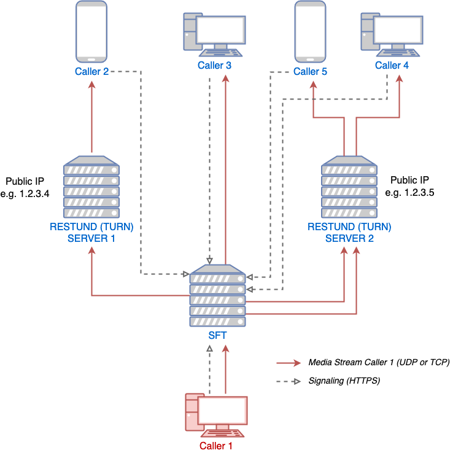

.. _understand-sft:

Conference Calling 2.0 (aka SFT)
================================

Background
----------

Previously, Wire group calls were implemented as a mesh, where each participant was connected
to each other in a peer-to-peer fashion. This meant that a client would have to upload their
video and audio feeds separately for each participant. This in practice meant that the amount
of participants was limited by the upload bandwidth of the clients.

Wire now has a signalling-forwarding unit called `SFT <https://github.com/wireapp/wire-avs-service>`__ which allows clients to upload once and
then the SFT fans it out to the other clients. Because connections are not end-to-end anymore now, dTLS encryption offered by WebRTC is not enough anymore as the encryption is terminated at the server-side. To avoid Wire from seeing the contents of calls SFT utilises WebRTC InsertibleStreams to encrypt the packets a second time with a group key that is not known to the server.

With SFT it is thus possible to have conference calls with many participants
without compromising end-to-end security.

Architecture
------------

Prerequisites
-------------

The SFT needs to be reachable by clients on its public IP and should be able to reach the :ref:`TURN <understand-restund>` servers as well for it to function.

The SFT needs to be able to receive and send traffic over UDP and TCP on a wide range of ports.
Due to the fact that Kubernetes services do not support setting port ranges, and kubernetes pods not being publicly routable (at least in IPv4) we require the SFT pods to run in `hostNetwork` mode and the pod will bind directly to the default interface of the node.

Due to this `hostNetwork` limitation only one SFT instance can run per node so if you want to scale up your SFT deployment you will need to increase the amount of kubernetes nodes in your cluster.

As a rule of thumb you will need 1vCPU of compute per 50 participants. SFT will utilise multiple cores. You can use this rule of thumb to decide how many kubernetes nodes you need to provision.

For more information about capacity planning and networking please refer to the `technical documentation <https://github.com/wireapp/wire-server/blob/eab0ce1ff335889bc5a187c51872dfd0e78cc22b/charts/sftd/README.md>`__
