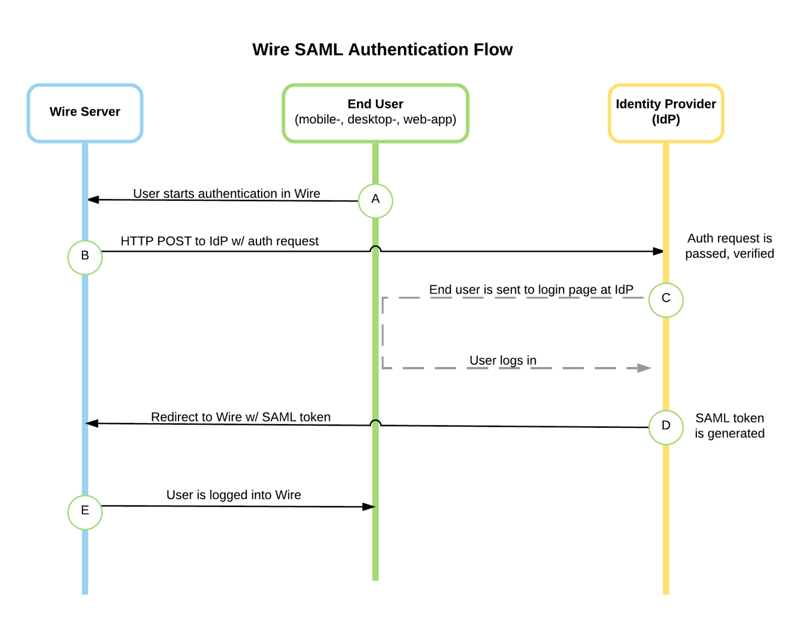

Single-sign-on background and design choices (fragment)
=======================================================

Overview
--------

Here is a blog post we like about how SAML works: https://duo.com/blog/the-beer-drinkers-guide-to-saml

And here is a diagram that explains it in slightly more technical terms:

See also
--------

:ref:`Trouble shooting & FAQ <trouble-shooting-faq>`

A critique of XML security, and why you should use oauth instead: https://www.cs.auckland.ac.nz/~pgut001/pubs/xmlsec.txt
