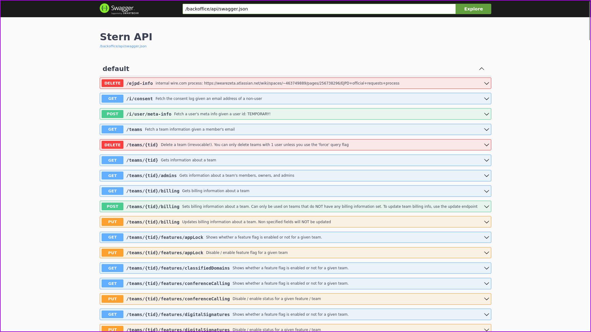
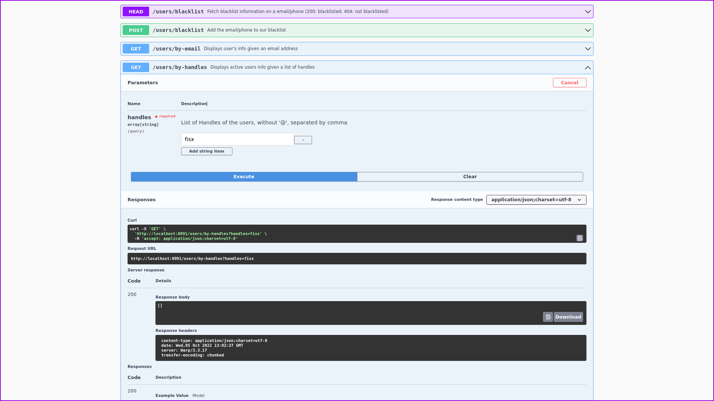
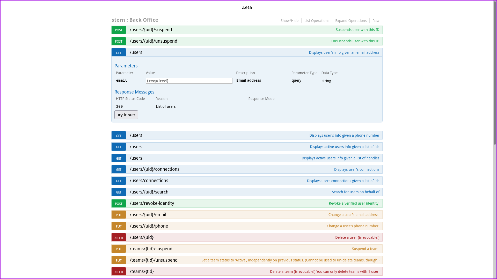
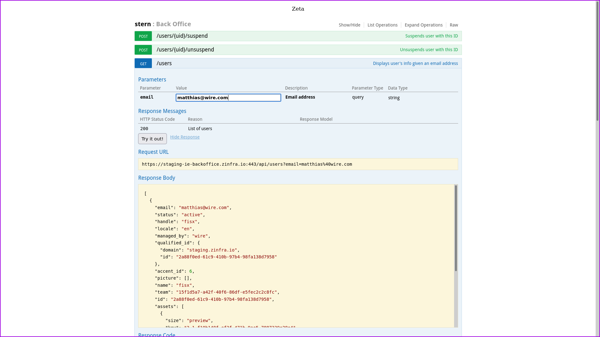

Stern - Backoffice Facade
=========================

This is a simple web app based on [swagger-ui](https://swagger.io/tools/swagger-ui/) for performing operations on users and teams such as browsing their user profiles, suspending, or deleting accounts. It is used internally at Wire by our customer support team.

Stern is based on a swagger interface that accesses multiple other services (mostly using internal endpoints) and is designed to be a simple way to create a basic backoffice functionality. Point your browser at `http://<ip-or-host>:<port>/backoffice/api/swagger-ui/`; `<port>` is usually 8091.

## IMPORTANT NOTES

If you want to deploy this together with the rest of the wire-server services, do _NOT_ expose this to the public internet; this will give anyone with access to it a way to look into users' metadata and other potentially sensitive information.

It is intended to be deployed in a private network and accessible only through a VPN (for instance).

Some endpoints (marked as such on the Swagger interface) depend on internal services (named galeb and ibis) that are not relevant for a generic wire server installation as they gather info from other internal systems at Wire (related to billing or other services) and as such will not work properly on installations without them.

## How to run stern together with the rest of wire-server

TODO: This section is under construction

## How to run stern locally

Start local services via `services/start-services-only.sh`

Open `http://localhost:8091/backoffice/api/swagger-ui/` in a browser.

## Screenshots

# Legacy mode:

(one could argue that the old swagger-ui was a little more
end-user-friendly, to which one could respond that neither version is
intended for end-users, but for web-devs, and we should just spend a
week writing an elm app that does this right.  :))
